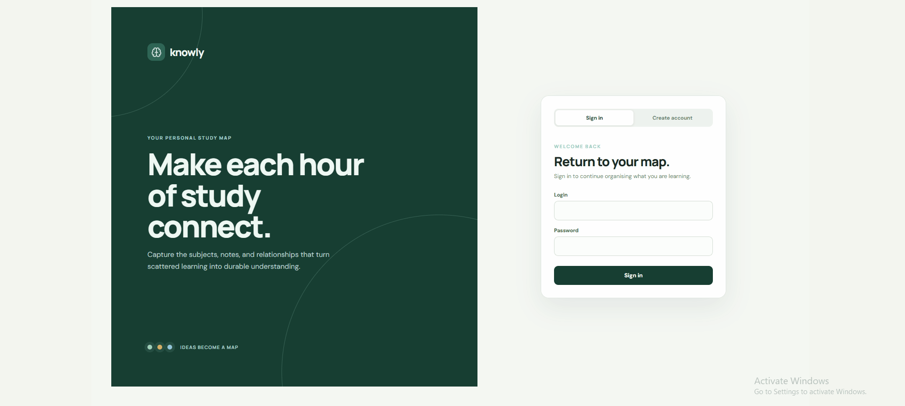

# Knowledge Tracker

Knowledge Tracker is a study-management application with a React frontend and an ASP.NET Core API. It lets authenticated users create subjects, connect related topics, and save study notes.

## Application Screens

The demonstration below shows the main user flow currently available in the application: authentication, creation and tracking of study goals, navigation through knowledge nodes, and registration of notes associated with the corresponding study structure.

As the tool makes painfully obvious, I have not been particularly consistent with my studies lately 😝



## Prerequisites

- .NET SDK 10
- Node.js and npm
- SQL Server or SQL Server LocalDB
- PowerShell on Windows

## First-time setup

From the repository root, restore both application stacks:

```powershell
dotnet restore src/KnowledgeTracker/KnowledgeTracker.slnx
npm install --prefix src/frontend
```

### Configure the backend

Create `src/KnowledgeTracker/KnowledgeTracker.Web/appsettings.Development.json` if it does not exist. Configure the `KnowledgeTracker` SQL Server connection string:

```json
{
  "ConnectionStrings": {
    "KnowledgeTracker": "Server=(localdb)\\MSSQLLocalDB;Database=KnowledgeTracker;Trusted_Connection=True;TrustServerCertificate=True"
  }
}
```

The API also requires two Base64-encoded secrets, each at least 32 bytes after decoding. Store them with .NET user secrets:

```powershell
dotnet user-secrets --project src/KnowledgeTracker/KnowledgeTracker.Web set "Authentication:AccessTokenSigningKey" "<base64-secret>"
dotnet user-secrets --project src/KnowledgeTracker/KnowledgeTracker.Web set "Authentication:RefreshTokenPepper" "<base64-secret>"
```

Generate a suitable secret in PowerShell:

```powershell
$bytes = New-Object byte[] 64
$rng = [System.Security.Cryptography.RandomNumberGenerator]::Create()
$rng.GetBytes($bytes)
[Convert]::ToBase64String($bytes)
```

Run the command twice—once for each secret.

As an alternative for local configuration, create an untracked `src/KnowledgeTracker/.env.json` using the same JSON sections as appsettings. Values in appsettings take precedence; missing values fall back to `.env.json`, while command-line arguments and environment variables remain higher priority.

## Apply database migrations

Migrations are explicit SQL files in `src/KnowledgeTracker/KnowledgeTracker.Data/migrations`. Apply unapplied migrations with:

```powershell
npm run migrate
```

The migration runner reads the development connection string, applies files in sequence, records them in `dbo.SchemaMigrations`, verifies their checksums, and locks migration execution so concurrent runs cannot conflict.

## Seed the local starter workspace

After the schema migrations complete, create the `student` account, subjects, and study notes separately:

```powershell
npm run seed
```

Sign in with `student` / `student`. The seed is idempotent, so rerunning it preserves existing seeded records.

For deployment or CI, provide the connection string through an environment variable instead:

```powershell
$env:ConnectionStrings__KnowledgeTracker = "<connection string>"
dotnet run --project src/KnowledgeTracker/KnowledgeTracker.Migrations
```

## Run locally

Start the backend and frontend from the repository root:

```powershell
npm run dev
```

The command builds the solution, starts both processes in the current terminal, and stops them when you press `Ctrl+C`.

| Service | Address |
| --- | --- |
| Frontend | `http://localhost:5173` |
| Backend API | `http://localhost:5015` |

The development script does not start the MCP server. Start the MCP process separately after configuring its listener, application URL, and MCP access token. It does not need a SQL Server connection string because it does not access the database directly:

```powershell
$env:McpServer__ListenAddress = "127.0.0.1"
$env:McpServer__Port = "3001"
$env:McpServer__McpEndpointPath = "/mcp"
$env:McpServer__ApplicationBaseUrl = "http://localhost:5015"
$env:McpServer__AccessToken = "mcp_<identifier>_<secret>"
$env:McpServer__WorkspaceId = "Personal;Codex Plan"
dotnet run --project src/KnowledgeTracker/KnowledgeTracker.Mcp
```

The MCP server uses the official Streamable HTTP transport and is available at `http://127.0.0.1:3001/mcp` with the configuration above. Configure your MCP client to connect to that URL. For file-based configuration, copy `src/KnowledgeTracker/KnowledgeTracker.Mcp/appsettings.mcp.example.json` to the ignored `src/KnowledgeTracker/KnowledgeTracker.Mcp/appsettings.mcp.local.json` file and edit the copy; the example file is documentation only and is never loaded. Every MCP tool call must include the `workspaceName` where it should run. `WorkspaceId` contains workspace names for the optional server-side allowlist: an empty value permits any user-owned workspace, while multiple permitted names must be separated with semicolons. The MCP server resolves the selected name for the authenticated user and forwards its ID to the Web application as one `X-Workspace-Id` header. Environment variables such as `McpServer__AccessToken` can be used instead of the local file.

### MCP authentication and authorization

The MCP server sends this MCP access token when calling the dedicated MCP routes in the Web application:

```http
Authorization: Bearer mcp_<identifier>_<secret>
```

Create and manage tokens through the authenticated Web API. The raw token is returned only by the create response; save it immediately because it is never returned by list or revoke operations:

```http
POST http://localhost:5015/api/mcp-access-tokens
Authorization: Bearer <normal-access-token>
Content-Type: application/json

{
  "name": "Desktop MCP client",
  "expiresAtUtc": "2026-12-31T23:59:59Z",
  "scopes": ["subjects:read", "notes:read"]
}
```

The available MCP client scopes are `subjects:read`, `subjects:write`, `topics:read`, `topics:write`, `notes:read`, `notes:write`, `goals:read`, `goals:write`, `connections:read`, `connections:write`, `layouts:read`, `layouts:write`, `metrics:read`, `metrics:write`, and `tokens:manage`. These scopes define which operations that MCP client may perform; there is no separate user-scope intersection. The token is still bound to its owning user. The MCP client selects the workspace by name per operation, and the server's configured `WorkspaceId` names restrict that selection when non-empty.

MCP operations use dedicated `/mcp-api/...` routes and a dedicated `McpAccessToken` authentication scheme. Normal `/api/...` routes and normal user access tokens are not used for MCP tool operations. The application services remain responsible for enforcing the MCP client scopes, while the MCP process only translates tool calls into those routes. Revoke a token with `DELETE /api/mcp-access-tokens/{id}` using a normal user access token; expiration and revocation invalidate it independently of normal application sessions.

To stop processes started by the development script from another terminal:

```powershell
npm run dev:stop
```

## Useful commands

```powershell
# Build the backend
dotnet build src/KnowledgeTracker/KnowledgeTracker.slnx -m:1

# Build the frontend for production
npm run build --prefix src/frontend

# Reapply pending database migrations
npm run migrate
```

## Project structure

- `src/frontend` — React and Vite frontend
- `src/KnowledgeTracker/KnowledgeTracker.Domain` — domain model
- `src/KnowledgeTracker/KnowledgeTracker.Application.Contracts` — application use-case interfaces and DTOs
- `src/KnowledgeTracker/KnowledgeTracker.Application` — use-case orchestration and implementations
- `src/KnowledgeTracker/KnowledgeTracker.Data` — SQL repositories and migrations
- `src/KnowledgeTracker/KnowledgeTracker.Infrastructure` — authentication and infrastructure services
- `src/KnowledgeTracker/KnowledgeTracker.Web` — ASP.NET Core HTTP API
- `src/KnowledgeTracker/KnowledgeTracker.Mcp` — separate MCP Streamable HTTP inbound adapter that calls dedicated application routes
- `src/KnowledgeTracker/KnowledgeTracker.Migrations` — executable SQL migration runner

## Architecture follow-ups

These are documented improvement items; they are intentionally not implemented yet.

1. **Workspace loading scales badly.** `src/frontend/knowledge/api/knowledgeClient.js:34` makes several requests per subject. Each subject detail then recursively loads descendant notes and reloads all layouts again in `src/KnowledgeTracker/KnowledgeTracker.Application/Knowledge/UseCases/SubjectService.cs:17`. With 100 subjects, this can become hundreds of HTTP calls and repeated database work.
2. **Layout changes can be silently lost.** `src/frontend/App.jsx:285` clears pending positions before the request succeeds. Workspace switching ignores the returned failure, so a failed save loses the queued layout while the UI still changes workspace.
3. **Invalid or missing workspace headers become server errors.** `src/KnowledgeTracker/KnowledgeTracker.Web/Authentication/Services/CurrentWorkspaceContext.cs:17` throws, but the normal API has no global exception-to-ProblemDetails handler. A malformed or missing `X-Workspace-Id` can become HTTP 500 instead of a clear 400/401 response.
4. **Deployment is localhost-dependent.** `src/frontend/knowledge/api/knowledgeClient.js:1` defaults to `http://localhost:5015`. If the frontend is deployed elsewhere without `VITE_API_BASE_URL` at build time, users' browsers call their own machine.
5. **Browser state does not reconcile external changes.** Changes made through MCP, another tab, or another client do not appear until the frontend reloads the workspace. There is no refetch, polling, or push update mechanism.
6. **The two API surfaces can drift.** Normal `/api/*` controllers and MCP `/mcp-api/*` controllers share services but duplicate HTTP contracts. The failing MCP parameter test in `src/KnowledgeTracker/KnowledgeTracker.Tests/Mcp/KnowledgeToolsContractTests.cs:61` is evidence of that drift.
